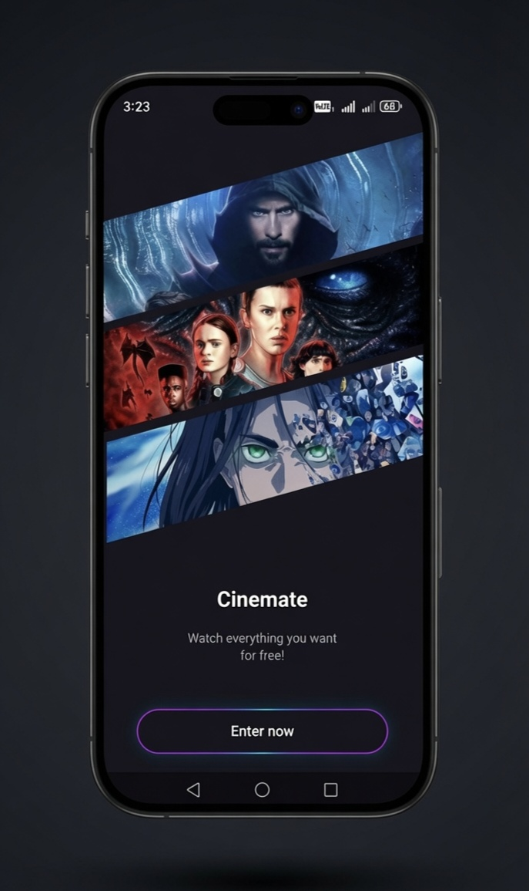
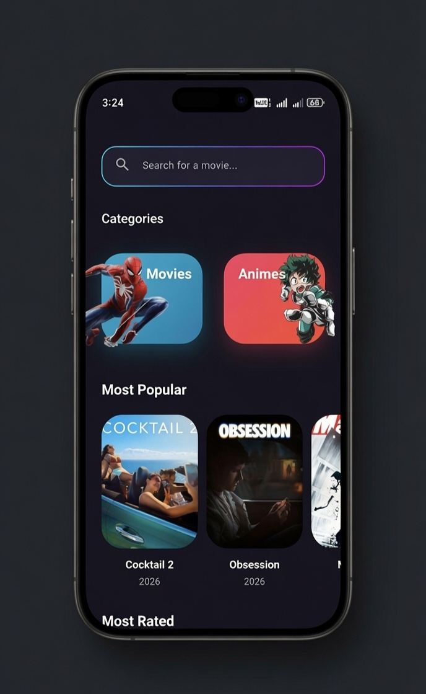
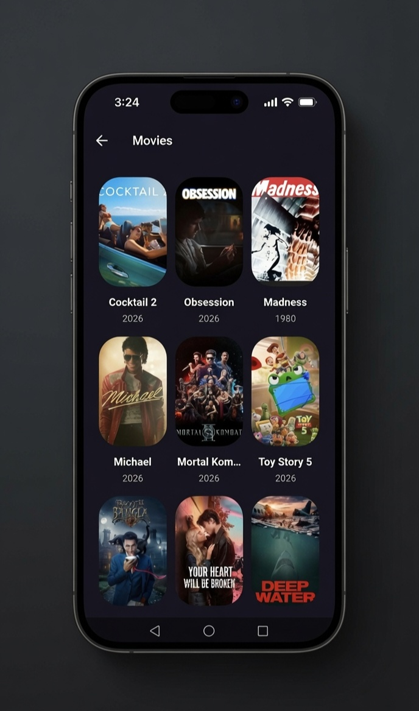
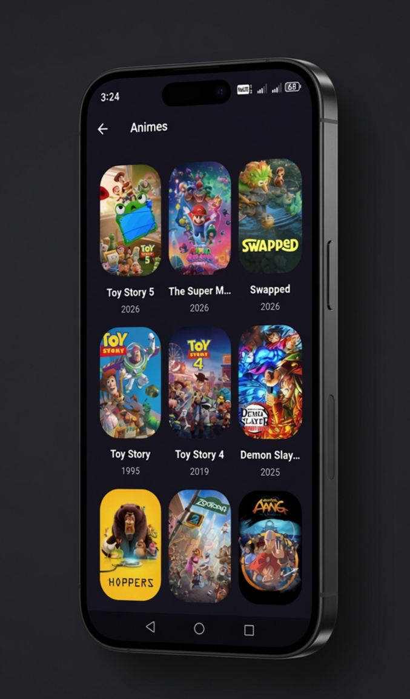
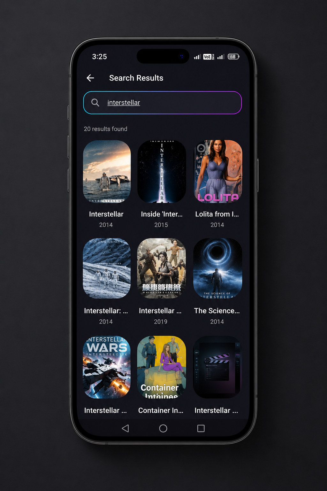
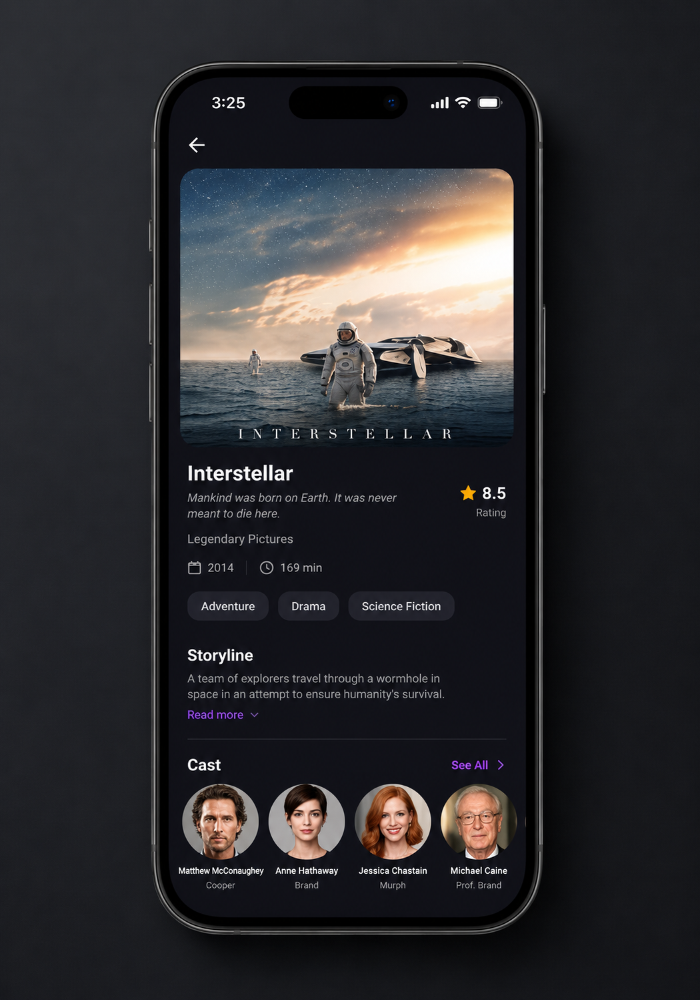
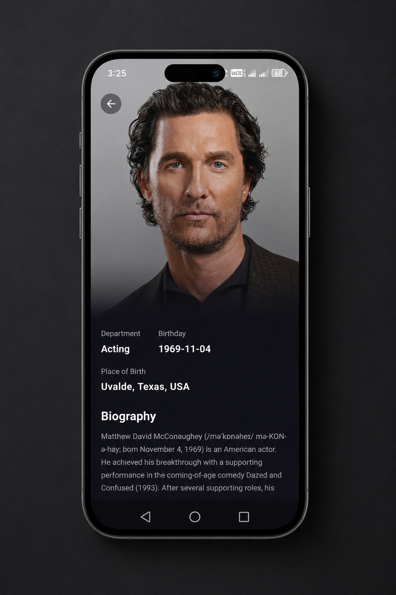

<div align="center">
  
  <h1>Cinemate - Flutter Movie Application</h1>
  <p>A premium, feature-rich movie and trailer discovery application built with Flutter using Clean Architecture.</p>

  <p>
    <a href="https://flutter.dev"></a>
    <a href="https://dart.dev"></a>
    <a href="https://bloclibrary.dev/#/"></a>
    <a href="https://www.themoviedb.org/"></a>
  </p>
</div>

---

## 🌟 Overview

**Cinemate** is a modern, responsive, and highly animated movie discovery application. Built to showcase enterprise-level Flutter development, it implements **Clean Architecture** principles, reactive state management using **BLoC**, and features a stunning dark-themed UI. 

A standout feature of this app is the **Global Mini Player**, which allows users to minimize movie trailers into a floating Picture-in-Picture (PiP) window that persists seamlessly across different screens while navigating the app.

---

## 📸 App Gallery (Screenshots)

Here is a glimpse of the Cinemate app's intuitive and beautiful user interface:

<div align="center">
  
  
  
  
</div>
<br>
<div align="center">
  
  
  
</div>

---

## ✨ Features

- **🎬 Global Floating Mini Player:** Watch YouTube trailers in a draggable, persistent PiP overlay that stays active while you browse other movies.
- **🔍 Smart Debounced Search:** Instantly search for movies with API debouncing to ensure optimal network performance.
- **📱 Clean Architecture:** Strictly separated Data, Domain, and Presentation layers for extreme scalability and testability.
- **🎨 Premium UI/UX:** Dark-themed UI with glassmorphism, fluid animations, and custom gradient highlights.
- **⏳ Skeleton Loading States:** Beautiful shimmer effects (using `skeletonizer`) during API calls to improve perceived performance.
- **💾 Image Caching:** Seamless image loading and local caching for optimized bandwidth usage using `cached_network_image`.
- **🗃️ Offline Capabilities:** Configured with `Hive` for fast, lightweight local storage.

---

## 🏗️ Architecture

This project follows the **Clean Architecture** pattern to separate concerns and maintain a scalable codebase.

```text
lib/
├── core/               # App-wide constants, networking, errors, and UI themes
├── features/           # Feature-based modular architecture
│   ├── home/           # Data, Domain, and Presentation for Home Screen
│   ├── movie_detail/   # Data, Domain, and Presentation for Details & Trailers
│   └── category/       # Data, Domain, and Presentation for Genre filtering
├── injection_container.dart  # Dependency Injection setup using get_it
└── main.dart           # App entry point
```

Each feature is divided into:
- **Domain:** Entities, Repositories (Interfaces), and UseCases.
- **Data:** Models, Repositories (Implementations), and Remote/Local Data Sources.
- **Presentation:** BLoCs/Cubits for state management, Views, and Widgets.

---

## 🛠️ Tech Stack & Packages

- **Framework:** [Flutter](https://flutter.dev/)
- **State Management:** [flutter_bloc](https://pub.dev/packages/flutter_bloc)
- **Dependency Injection:** [get_it](https://pub.dev/packages/get_it)
- **Network:** [dio](https://pub.dev/packages/dio) & [dartz](https://pub.dev/packages/dartz) (Functional Error Handling)
- **Video Player:** [youtube_player_flutter](https://pub.dev/packages/youtube_player_flutter) & [flutter_inappwebview](https://pub.dev/packages/flutter_inappwebview)
- **Local Storage:** [hive](https://pub.dev/packages/hive) & [hive_flutter](https://pub.dev/packages/hive_flutter)
- **UI & Animations:** 
  - [skeletonizer](https://pub.dev/packages/skeletonizer) (Loading states)
  - [cached_network_image](https://pub.dev/packages/cached_network_image) (Image caching)
  - [google_fonts](https://pub.dev/packages/google_fonts) (Typography)

---

## 🚀 Getting Started

### Prerequisites
- Flutter SDK (`>=3.9.2`)
- Dart SDK
- [TMDB API Key](https://developer.themoviedb.org/docs)

### Installation

1. **Clone the repository:**
   ```bash
   git clone https://github.com/your-username/movie_app.git
   cd movie_app
   ```

2. **Get packages:**
   ```bash
   flutter pub get
   ```

3. **Configure the API Key:**
   Navigate to `lib/core/network/api_constants.dart` and insert your TMDB API Key:
   ```dart
   class ApiConstants {
     static const String baseUrl = 'https://api.themoviedb.org/3';
     static const String apiKey = 'YOUR_TMDB_API_KEY_HERE';
     // ...
   }
   ```

4. **Run the App:**
   ```bash
   flutter run
   ```

---

## 💡 Key Implementations Highlight for Code Reviewers

- **State Persistence:** The `GlobalMiniPlayer` utilizes a customized `OverlayEntry` integrated with `BlocBuilder` to ensure the YouTube player controller lifecycle is preserved and doesn't crash during route pops.
- **Debounced Searching:** Inside `home_cubit.dart`, the search function uses a custom `Timer` implementation to delay API requests until the user stops typing, reducing unnecessary API load.
- **Error Handling:** `Dio` interceptors and `dartz` `Either` types are used heavily in the repository layer to catch network exceptions and pass them gracefully to the UI state.
- **Clean Architecture Enforcement:** Data and UI layers are completely decoupled by Domain entities, making the codebase highly testable and robust for future scaling.
